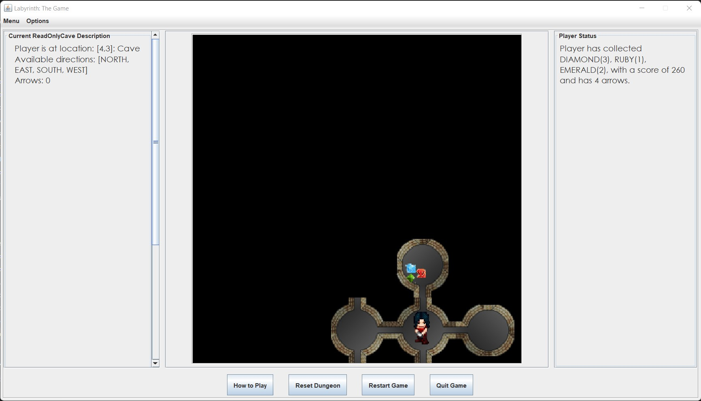
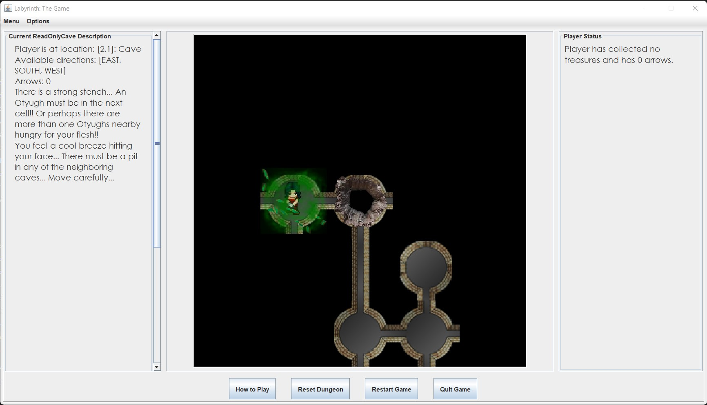

# Labyrinth Dungeon MVC

#### Samreen Reyaz Ansari

##### Programming Design Paradigm

*Snapshots of the game:*

1. **About:** The Labyrinth Dungeon MVC represents a maze game where we have a player navigating through the maze. There is a start and an exit to the maze. It is a user-driven program and the user can guide the player to the exit by choosing each step of the player. Users can either play in GUI mode or console mode.

2. **List of features**:

   - *Obstacles*: You can find them stopping you from reaching the exit of the dungeon
     - **Otyugh**: There are multiple Otyugh spread throughout the dungeon. There is always one at the exit cave. If you encounter an Otyugh, it will devour you and the game will end! Luckily, you will have arrows to try and kill the monster. If you hit the monster once, it will be injured and if you enter their cave, you might have a chance of escaping. The Otyugh can be killed by shooting it twice. They are filthy creatures and you will be able to smell them from neighboring caves which will alert you of their presence. A faint stench indicates a monster two cells away from you, and a strong stench indicates that either an Otyugh is in the next cell or there are more than once Otyugh near you.
     - **Shadow**: The Shadow monster will roam around the dungeon looking for you. If it finds you, you will enter combat mode and you might be able to kill the monster, or you will be dead and your adventure will end.
     - **Thief**: There is also a thief roaming around in the dungeon. Whenever if finds you, it will steal all of your treasure. And you may encounter him again and again. Beware!
     - **Pits**: Certain caves have a giant pit which you will fall into if you enter the cave. You will survive, but while trying to climb out, you will lose all of your treasures and arrows. To indicate that a pit is nearby, you will feel a breeze in all of its adjacent cells.
   - *Movement*: You can only know about the cells that you have visited. You can move in the dungeon in the available directions from one or more of North, South, East, and West.
   - *Treasure*: You can find treasures such as rubies, diamonds and emeralds in the dungeon that you can collect if you are in the same cave. Arrows are also available that can be used to shoot Otyughs.
   - *Shooting Monsters*: You also have the ability to shoot Otyughs by using arrows if you have any. Arrows cannot be repicked and will reduce from your inventory when you shoot them. 

3. **How To Run**: 

   - The Labyrinth.jar file can be found in the /res directory.
   - You can play in GUI mode or console mode
   - *To run in console mode:*
     - Type "java -jar Labyrinth.jar <height> <width> <interconnectivity> <isWrapping> <percentage of caves with treasure> <difficulty>" on the terminal within the directory.  For example, "java -jar Labyrinth.jar 5 5 3 true 25 8". 
   - *To run in GUI mode:*
     - Type "java -jar Labyrinth.jar" on the terminal within the directory
   
4. **How to Use the Program**: 

   - ***Console mode:***
     - The interactive program will ask the user for input at each step. The user can select from four options: Move, Pick, Shoot and Quit.
     - *Move*:
       - Enter "move <direction>" or "m <direction>" for attempting to move in that particular direction
       - <direction> can be north/south/west/east/n/s/w/e
     - *Pick*:
       - Enter "pick" or "p" for attempting to pick all the arrows and treasures in the current position
     - *Shoot*:
       - Enter "shoot <direction> <distance>" for attempting to shoot in the given direction till the given distance
       - <direction> can be north/south/west/east/n/s/w/e
       - <distance> can be a number between 1 and 5 inclusive
     - *Quit*:
       - Enter "quit" or "q" to exit the game
   - ***GUI mode:***
     - *Movement*: You can only view the cells that you have visited. To move around in the dungeon, you can use:
       - **Arrow keys**
       - **WASD keys**
       - **Click** in the same row/column of the direction you want to move towards
     - *Collecting Treasure*: If you see treasure and/or arrows in the cell you are currently in, you can:
       - press the **P key** on the keyboard
       - **Click** on the cell you are currently present in
     - *Shooting Monsters*: To shoot an Otyugh, you have to specify the direction and a distance. Arrows are crooked can can bend to travel through curved tunnels. But they can only travel straight through caves. To shoot:
       1. First, press the **K key** on the keyboard
       2. Then, select a direction using the **arrow keys**
       3. Lastly, select a number from 1 to 5 for the distance using the **numpad** or the number row.
     - *Settings and Options*:
       - Reset Dungeon: Replay the same dungeon
       - Restart Game: Restart the game with a new dungeon
       - Configure > Settings: Customize the game settings:
         - **Rows**: the number of rows in the dungeon (minimum 4, maximum 25)
         - **Columns**: the number of columns in the dungeon (minimum 4, maximum 25)
         - **Interconnectivity**: The number of paths between any two cells of the dungeon above 1 (minimum 0)
         - **Wrapping**: Indicates whether the caves wrap around the edges. i.e. if some of the top row cells and connected to the bottom-most cell and some of the right-most cells are connected to the left-most cells. (true for wrapping and false for non-wrapping)
         - **% Treasures**: the percentage of treasures and arrows that can be found in the dungeon (minimum 1)
         - **Difficulty**: the number of Otyughs to be present in the dungeon (minimum 1)

5. **Description of Examples:**

   - The screenshots each represent a certain instance of the game to show the various components of the game

6. **Design/Model Changes**: 

   - Removed Thief and NekkerMonster package-private classes
   - Added Miscreant package-private class
   - Renamed Nekker to Shadow
   - Added methods to Dungeon for getting information about thief, pit, and shadow
   - Added ReadOnlyCave to let view access details for updating

7. **Assumptions:** 

   - Moving in a cave does not mean that the treasure/arrows in it will be picked
   - User can pick treasure and arrows only from the current cell
   - A player can only move to adjacent nodes
   - A player can only move one node at a time
   - A player can only move to a neighbor if there is an edge from current node to the neighbor
   - All edges are bi-directional
   - A player can stop at at tunnel
   - Arrows cannot be reclaimed
   - Extra Otyughs (more than the number of caves) are discarded
   - Player cannot fire arrow in the same cave
   - Can only shoot arrow in the directions available
   - Can only shoot between a distance of 1 to 5
   - Player cannot hit themselves
   - Stench cannot travel through walls
   - There is a single Shadow monster and a single thief in the dungeon
   - Pit can only be added in caves and not tunnels
   - Shadow and thief will not spawn in a location with an otyugh
   - Thief and shadow move around the dungeon with 50% probability

8. **Limitations**: 

   - Player can only view neighboring nodes

   - Dungeon of size smaller than 4x4 and larger 25x25 cannot be created

   - It is possible for the program to never end if the user keeps getting stuck in a loop deliberately

   - No option to pick up treasure and arrows separately

   - No option to configure number of Shadows in the dungeon

   - No option for player to choose moves in hand-to-hand combat with shadow

     

9. **Citations:** 

   - Department of Math/CS - Home. (n.d.). Retrieved December 10, 2021, from http://www.mathcs.emory.edu/~cheung/Courses/377/Syllabus/8-JDBC/GUI/containers. 
   - *How to use gridbaglayout*. How to Use GridBagLayout (The Java™ Tutorials > Creating a GUI With Swing > Laying Out Components Within a Container). (n.d.). Retrieved December 10, 2021, from https://docs.oracle.com/javase/tutorial/uiswing/layout/gridbag.html. 
   - *A visual guide to layout managers*. A Visual Guide to Layout Managers (The Java™ Tutorials > Creating a GUI With Swing > Laying Out Components Within a Container). (n.d.). Retrieved December 10, 2021, from https://docs.oracle.com/javase/tutorial/uiswing/layout/visual.html. 
   - *How to use text fields*. How to Use Text Fields (The Java™ Tutorials > Creating a GUI With Swing > Using Swing Components). (n.d.). Retrieved December 10, 2021, from https://docs.oracle.com/javase/tutorial/uiswing/components/textfield.html. 
   - *Adding JPanel to jscrollpane - java: Dream.in.code*. : Programming & Web Development Community. (n.d.). Retrieved December 10, 2021, from https://www.dreamincode.net/forums/topic/337707-adding-jpanel-to-jscrollpane/. 
   - BorderFactory (Java Platform SE 7 ). (2020, June 24). Retrieved December 10, 2021, from https://docs.oracle.com/javase/7/docs/api/javax/swing/BorderFactory.html. 
   - *JTEXTAREA to look like jlabel*. oracle. (n.d.). Retrieved December 10, 2021, from https://community.oracle.com/tech/developers/discussion/1374176/jtextarea-to-look-like-jlabel. 
   - WhimusicalWhimusical                    5, BoroBoro                    7, & Andrew ThompsonAndrew Thompson                    166k4040 gold badges206206 silver badges414414 bronze badges. (1960, July 1). *How to get a multilined jlabel (or a jtextarea looking totally the same) without HTML*. Stack Overflow. Retrieved December 10, 2021, from https://stackoverflow.com/questions/11033800/how-to-get-a-multilined-jlabel-or-a-jtextarea-looking-totally-the-same-without. 
   - *How to use BoxLayout*. How to Use BoxLayout (The Java™ Tutorials > Creating a GUI With Swing > Laying Out Components Within a Container). (n.d.). Retrieved December 10, 2021, from https://docs.oracle.com/javase/tutorial/uiswing/layout/box.html. 
   - *Java JMenuBar, JMenu and jmenuitem - javatpoint*. www.javatpoint.com. (n.d.). Retrieved December 10, 2021, from https://www.javatpoint.com/java-jmenuitem-and-jmenu. 
   - Keyevent (Java Platform SE 7 ). (2020, June 24). Retrieved December 10, 2021, from https://docs.oracle.com/javase/7/docs/api/java/awt/event/KeyEvent.html. 
   - Baeldung. (2021, May 22). *How can I resize an image using Java?* Baeldung. Retrieved December 10, 2021, from https://www.baeldung.com/java-resize-image. 
   - Show confirm dialog with yes no buttons. (n.d.). Retrieved December 10, 2021, from https://www.tutorialspoint.com/swingexamples/show_confirm_dialog_with_yesno.htm. 
   - Joptionpane (Java Platform SE 7 ). (2020, June 24). Retrieved December 10, 2021, from https://docs.oracle.com/javase/7/docs/api/javax/swing/JOptionPane.html. 
   - *Java bufferedreader class - javatpoint*. www.javatpoint.com. (n.d.). Retrieved December 10, 2021, from https://www.javatpoint.com/java-bufferedreader-class. 
   - *How to use buttons, check boxes, and radio buttons*. How to Use Buttons, Check Boxes, and Radio Buttons (The Java™ Tutorials > Creating a GUI With Swing > Using Swing Components). (n.d.). Retrieved December 10, 2021, from https://docs.oracle.com/javase/tutorial/uiswing/components/button.html. 
   - Scanner (java platform SE 7 ). (2020, June 24). Retrieved December 10, 2021, from https://docs.oracle.com/javase/7/docs/api/java/util/Scanner.html. 

